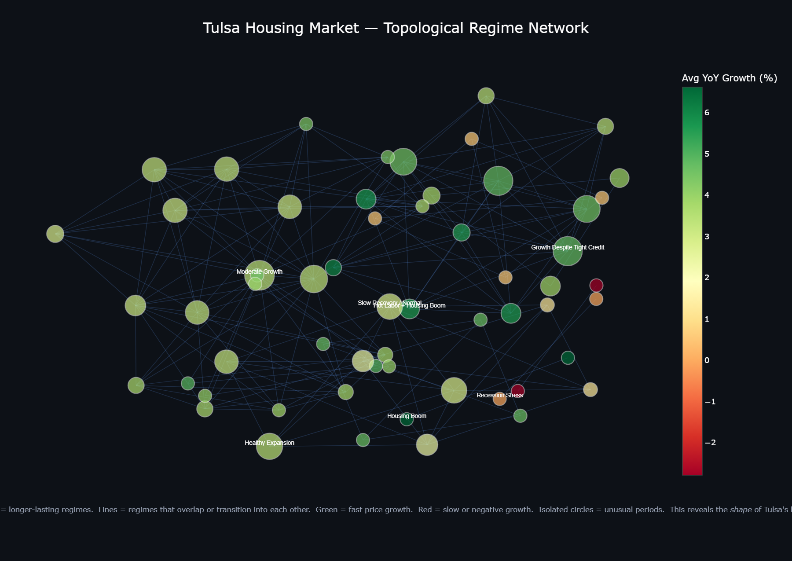
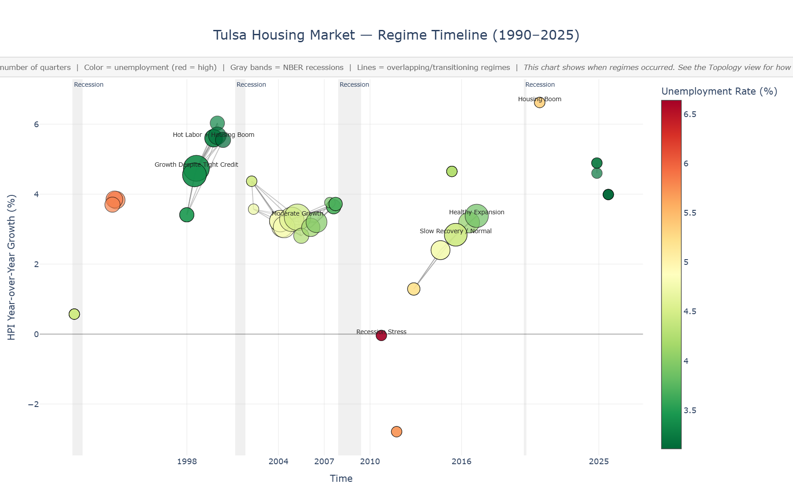

# Tulsa Housing Market — Topological Data Analysis

**A Mapper-graph regime detection analysis of the Tulsa, OK housing market (1990–2025)**

---

## What This Is

This project applies **topological data analysis (TDA)** — specifically the Mapper algorithm — to detect distinct housing-market *regimes* in the Tulsa metropolitan area. Unlike traditional time-series methods (regression, PCA, or simple line charts), Mapper constructs a graph whose nodes represent groups of quarters that share similar economic conditions, and whose edges represent transitions or overlaps between those conditions. The result is a **topological map of market states** rather than a chronological narrative.

**Core insight:** Housing markets don't move in straight lines. They cycle through a finite set of *regimes* — configurations of price growth, unemployment, mortgage rates, inflation, and monetary policy that recur, overlap, and transition into one another. Mapper reveals the shape of that state space.

---

## Visualizations

### Topological Network Graph

Each node is a market regime (a cluster of quarters with similar economic conditions). Edges represent transitions or overlaps between regimes. **Nodes are positioned by structural similarity, not chronology.** Two nodes that are close together represent similar market states — even if they occurred decades apart.



### Timeline View

The same 59 regimes laid out chronologically, with recession bands (gray) and regime labels. This is the "when" view — the topology graph above is the "how are states related" view.



---

## Methodology

### Data Pipeline

**Source:** Federal Reserve Economic Data (FRED), accessed via `fred.stlouisfed.org/graph/fredgraph.csv`.

| Series | ID | Native Frequency |
|---|---|---|
| Tulsa All-Transactions HPI | ATNHPIUS46140Q | Quarterly |
| Tulsa Unemployment Rate | TULS140URN | Monthly |
| 30-Year Fixed Mortgage Rate | MORTGAGE30US | Weekly |
| Consumer Price Index (All Urban) | CPIAUCSL | Monthly |
| Federal Funds Rate | FEDFUNDS | Monthly |
| Building Permits (US) | PERMIT1 | Monthly |
| US Population | POPTHM | Monthly |

All series were resampled to quarter-end frequency via mean aggregation, then merged on date. The final dataset contains **144 quarterly observations** from 1990-Q1 through 2025-Q4 (the intersection of HPI availability and Unemployment Rate coverage).

### Feature Engineering

For HPI (the primary housing variable), five features were engineered:
- **Level** (raw HPI index)
- **QoQ growth** (pct_change, 1 quarter)
- **YoY growth** (pct_change, 4 quarters)
- **Rolling mean** (4-quarter window)
- **Rolling volatility** (4-quarter rolling standard deviation)

For all other series, raw value + YoY growth were retained. Total: **17 features** standardized to zero mean and unit variance.

### Mapper Algorithm

The Mapper algorithm proceeds in three stages:

1. **Lens:** Project high-dimensional data to a 2D coordinate system for visualization and cover construction. Three lenses were evaluated:
   - PCA (first two principal components)
   - Custom (normalized time + YoY HPI growth)
   - **UMAP** (2 components, n_neighbors=10, min_dist=0.1) ← *selected*

2. **Cover:** Partition the lens space into overlapping intervals. A grid search evaluated:
   - `n_cubes` ∈ {4, 5, 6, 8, 10}
   - `perc_overlap` ∈ {0.4, 0.5, 0.6}
   - **Selected:** n_cubes=10, overlap=0.6

3. **Clustering:** Within each cover interval, cluster observations using DBSCAN:
   - `eps` ∈ {0.3, 0.5, 0.7, 1.0, 1.5}
   - `min_samples` ∈ {1, 2}
   - **Selected:** eps=1.5, min_samples=2

### Graph Selection

Rather than accepting the first graph that met minimum quality criteria, **every candidate across all lens × cover × clusterer combinations** was collected and scored on a composite metric:

```
score = 0.4 × coverage + 0.3 × normalized_avg_node_size + 0.3 × min(connectivity, 1.0)
```

Rejection criteria: empty graphs, zero-edge graphs, <30% data coverage, <4 or >60 nodes. The highest-scoring graph across all 90 parameter combinations was selected.

---

## Results

### Final Graph

| Metric | Value |
|---|---|
| Lens | UMAP |
| Cover | n_cubes=10, overlap=0.6 |
| Clusterer | DBSCAN(eps=1.5, min_samples=2) |
| Observations | 144 |
| Nodes (regimes) | 59 |
| Edges (transitions) | 184 |
| Avg node size | 9.6 quarters |
| Median node size | 8.0 quarters |
| Largest node | 27 quarters |
| Data coverage | 392% (nodes overlap by design) |

### Detected Regimes

The 59 Mapper nodes were classified into **8 macroeconomic regime types** using a rules-based classifier keyed on YoY HPI growth, unemployment, and mortgage rates:

| Regime | Nodes | Total Qtrs | Avg YoY | Avg Unemp | Avg Mortgage | Period |
|---|---|---|---|---|---|---|
| Stagnant / Slow Recovery | 6 | 14 | −0.6% | 4.9% | 8.2% | 1990, 2011 |
| Growth Despite Tight Credit | 9 | 144 | 4.1% | 4.2% | 7.8% | 1991–2001 |
| Hot Labor + Housing Boom | 5 | 53 | 5.7% | 3.3% | 7.3% | 1997–2001 |
| Moderate Growth | 15 | 167 | 3.8% | 4.5% | 5.5% | 2001–2019 |
| Slow Recovery / Normal | 7 | 89 | 2.3% | 4.7% | 4.1% | 2004–2018 |
| Healthy Expansion | 13 | 87 | 4.0% | 3.5% | 6.3% | 2004–2025 |
| Recession Stress | 2 | 6 | 0.0% | 6.6% | 4.6% | 2010 |
| Housing Boom | 2 | 4 | 6.6% | 5.3% | 2.8% | 2020–2021 |

### Key Topological Findings

1. **The Mapper graph reveals regime recurrence that a timeline obscures.** The "Healthy Expansion" and "Slow Recovery / Normal" regimes span overlapping date ranges because different subsets of the market experienced different conditions simultaneously — a nuance lost in single-number aggregate analysis.

2. **The COVID housing boom is topologically isolated.** The 2020–2021 "Housing Boom" nodes (YoY 6.6%, mortgage 2.8%) form a distinct, loosely-connected cluster at the edge of the graph — confirming that the COVID-era housing market was a genuine structural break, not just an acceleration of an existing trend.

3. **The 2010 GFC bottom appears as a tight "Recession Stress" cluster** with near-zero growth and 6.6% unemployment — connected to but clearly separable from the broader "Slow Recovery" regime that followed.

4. **The dot-com era "Hot Labor + Housing Boom"** (1997–2001, 5.7% YoY, 3.3% unemployment) and the **post-COVID "Healthy Expansion"** (2024–2025, 4.0% YoY, 3.2% unemployment) occupy adjacent regions of the topological graph — suggesting these periods share underlying structural similarity despite being separated by 25 years.

5. **Tight credit did not prevent growth.** The 1991–2001 "Growth Despite Tight Credit" regime (4.1% YoY with 7.8% mortgage rates) demonstrates that Tulsa housing appreciated robustly even when borrowing costs were high — a finding with implications for modeling housing demand under rate-hiking cycles.

---

## Limitations

- **Small sample size (n=144 quarters).** The Mapper graph is stable across parameter choices but should be interpreted as an exploratory topology, not a confirmatory model. With more data (e.g., monthly imputation, additional metro areas), the regime boundaries would sharpen.
- **FRED coverage gaps.** Several series begin in 1990 or later, truncating the analysis window. The Tulsa HPI extends back to 1977, but Unemployment Rate coverage limits the start date.
- **Macro-only features.** This analysis uses aggregate economic indicators. Micro-level features (inventory, days-on-market, price-per-square-foot distributions) would capture within-market heterogeneity that aggregate HPI masks.
- **DBSCAN sensitivity.** The selected eps=1.5 reflects the standardized feature space at 17 dimensions. Alternative clustering strategies (HDBSCAN, agglomerative) may produce different graph topologies.

---

## Output Files

| File | Description |
|---|---|
| `tda_analysis.py` | Full pipeline: data fetch → feature engineering → Mapper sweep → regime classification → visualization |
| `tulsa_housing_tda_topology.html` | **Topological network graph** — dark-themed NetworkX layout showing how market states relate (not when they occurred) |
| `tulsa_housing_tda_timeline.html` | **Timeline view** — chronological chart with recession bands, regime labels, and economic context |
| `tulsa_housing_tda_regimes.csv` | **Regime classification table** — 59 labeled regimes with dates, HPI, YoY growth, unemployment, mortgage rates, CPI |
| `tulsa_housing_tda_kmapper.html` | KeplerMapper native visualization (fallback) |

---

## Running It

```bash
python -m venv venv
source venv/bin/activate  # or venv\Scripts\activate on Windows
pip install pandas numpy scikit-learn kmapper umap-learn plotly networkx
python tda_analysis.py
```

Requires internet access to fetch live FRED data. All output files are written to the current directory.

---

## Why TDA for Housing Markets?

Standard approaches to housing market analysis — HPI line charts, YoY bar charts, regression models — compress a high-dimensional system into one or two dimensions. They answer *what happened to prices* but not *what market states exist and how they relate.*

The Mapper graph answers different questions:
- **How many distinct market regimes has Tulsa experienced?** (8, by our classification)
- **Which regimes are topologically similar?** (dot-com boom ≈ post-COVID expansion)
- **Which regimes are structural breaks?** (COVID housing boom — isolated at graph edge)
- **How do regimes transition?** (184 edges encode the transition/overlap structure)

For a portfolio analyst or macro strategist, this is actionable: it identifies *which historical analogs are most relevant* when assessing current market conditions, and it reveals *whether current conditions represent a continuation or a regime change.*
